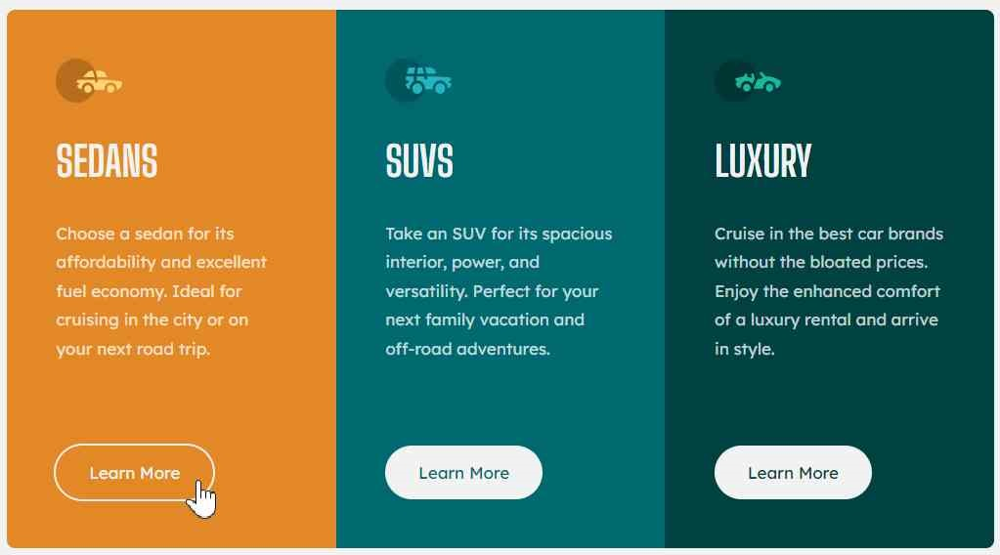

# Frontend Mentor - 3-column preview card component solution

This is a solution to the [3-column preview card component challenge on Frontend Mentor](https://www.frontendmentor.io/challenges/3column-preview-card-component-pH92eAR2-). Frontend Mentor challenges help you improve your coding skills by building realistic projects. 

## Table of contents

- [Overview](#overview)
  - [The challenge](#the-challenge)
  - [Screenshot](#screenshot)
  - [Links](#links)
- [My process](#my-process)
  - [Built with](#built-with)
  - [What I learned](#what-i-learned)
  - [Continued development](#continued-development)

## Overview

### The challenge

Users should be able to:

- View the optimal layout depending on their device's screen size
- See hover states for interactive elements

### Screenshot

### Links

- Live Site URL: (https://3-column-preview-card-component-ivory-xi.vercel.app/)

## My process

### Built with

- Semantic HTML5 markup
- CSS custom properties
- Flexbox
- Mobile-first workflow

### What I learned

- This was my first time using CSS variables to define colours. It made my workflow faster and easier to read.

- *overflow: hidden;* fixed the problem of border-radius not taking effect on "main" element caused by "section" elements overlapping and obscuring the rounded corners.

- Rather than manually setting each "Learn More" button color, I defined the background-color variable for each section to use as the value for the button color. This doesn't look like the most elegant solution due to the visual repetition, but I wanted to try something different.

- Used new range syntax for media queries - *@media (width > 768px)*.

### Continued development

- It is currently taking me a long time to build each component because every element will send me down a 1 hour rabbit hole learning about the mutiple different ways of doing things. Over time, I hope to increase my speed as I refine my process.